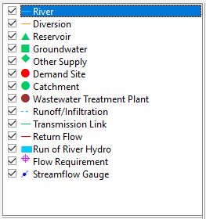
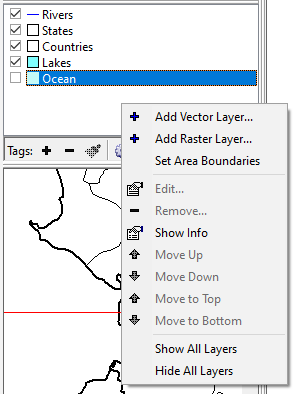
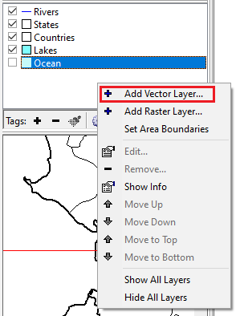
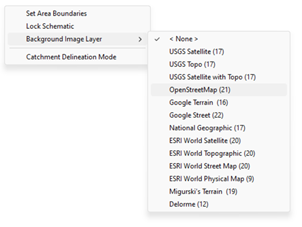
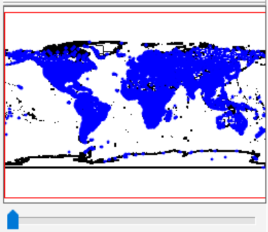
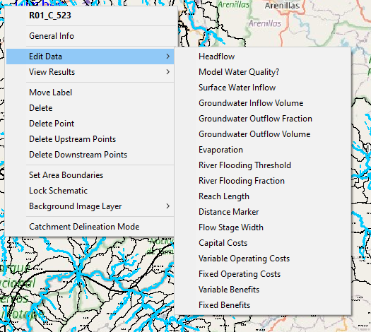

# ESQUEMÁTICA
La Vista Esquemática sirve como punto de partida para todas las actividades en WEAP. A continuación, se presentan los elementos que la componen junto con las funcionalidades que cada uno ofrece:

*	Leyenda de WEAP
<!-- Esquema WEAP (Tabla 1) -->
<table style="width: 100%; border: 0px; border-collapse: collapse; text-align:justify;">
  <tr>
    <td style="width: 50%; border: 0px;">
      
    </td>
    <td style="width: 50%; border: 0px;">
      La Vista Esquemática es el punto de partida para todas las actividades en WEAP. Una característica central de WEAP es su interfaz gráfica de "arrastrar y soltar" fácil de usar, que se emplea para describir y visualizar las características físicas del sistema de oferta y demanda de agua. Este diseño espacial se denomina esquema. Puede crearlo, editarlo y visualizarlo en la Vista Esquemática. Se pueden agregar capas SIG para brindar mayor claridad e impacto.
    </td>
  </tr>
</table>
 

* Gestor de Capas SIG en WEAP

El gestor de capas SIG en WEAP es una herramienta fundamental para <b>visualizar</b>, datos geográficos dentro del contexto de la herramienta. Su principal función reside en la superposición de información espacial sobre el esquema WEAP, permitiendo al usuario representar gráficamente elementos geográficos como ríos, cuencas hidrográficas, límites políticos, infraestructura hidráulica y otros datos relevantes para el análisis del sistema hídrico. Esto facilita la comprensión espacial del modelo y la identificación de patrones o relaciones entre los componentes del sistema.

Este gestor presenta las siguientes funcionalidades:
<!-- Gestor de Capas SIG en WEAP (Tabla 2) -->
<table style="width: 100%; border: 0px; border-collapse: collapse; text-align:justify;">
  <tr>
    <td style="width: 60%; border: 0px;">
      <b>Casilla de verificación</b> 
Esta función permite que cada capa se pueda ocultar o mostrar en el esquema. También permite ocultar o mostrar todos los mapas a la vez, haciendo clic derecho en la lista de capas de fondo y seleccionando "Ocultar o Mostrar todas las capas.
</td>
    <td style="width: 40%; border: 0px;">
      
    </td>
  </tr>
</table>
 

<!-- Gestor de Capas SIG en WEAP (Tabla 3) -->
<table style="width: 100%; border: 0px; border-collapse: collapse; text-align:justify;">
  <tr>
    <td style="width: 40%; border: 0px;">
      
    </td>
    <td style="width: 60%; border: 0px;">
      <b>Agregar una capa vectorial o raster</b> 
      Haga clic derecho en el gestor de capas SIG y seleccione "Agregar capa vectorial" o "Agregar capa ráster" según su interés. 
      Referente a las capas vectoriales, WEAP ofrece mucha flexibilidad para elegir colores de mapa, datos, estilos y etiquetas para la visualización, lo que puede ser muy útil para resaltar varias características de las capas.  También le permite eliminar, establecer etiquetas o reordenar los mapas de fondo.
Tenga en cuenta que puede eliminarlos si lo desea, pero su esquema debe tener al menos una capa de fondo (ya sea una capa precargada o una propia). 
    </td>
  </tr>
</table>

<b>Nota</b>: Todas las capas de fondo deben usar la misma proyección geográfica. Si agrega una capa y no aparece en el Esquema, puede deberse a que no usa la misma proyección que las capas de fondo existentes. Las capas globales precargadas de WEAP utilizan la proyección WGS84. Si desea agregar capas que utilizan una proyección diferente a WGS84, debe hacer lo siguiente (Tenga en cuenta que debe hacer esto ANTES de agregar cualquier objeto WEAP, como ríos o sitios de demanda, porque cuando los agregue, utilizarán la proyección vigente y desaparecerán cuando cambie a una proyección diferente):

1. Agregue una de sus capas.
2. Elimine todas las capas (como las capas precargadas) que estén en una proyección diferente.
3. Vaya a "Establecer límites del área" y configure el límite usando su nueva capa.
4. Si su capa es visible en el Esquema, entonces lo ha hecho correctamente.
 
 

<!-- Gestor de Capas SIG en WEAP (Tabla 4) -->
<table style="width: 100%; border: 0px; border-collapse: collapse; text-align:justify;">
  <tr>
    <td style="width: 60%; border: 0px;">
      <b>Agregar mapas base</b> 
        Haga clic derecho en el visor geográfico 
        Seleccione la opción “Background Image Layer” y ahí la capa de su preferencia
    </td>
    <td style="width: 40%; border: 0px;">
      
    </td>
  </tr>
</table>
 

*	Vista Esquema Detallado

<!-- Gestor de Capas SIG en WEAP (Tabla 5) -->
<table style="width: 100%; border: 0px; border-collapse: collapse; text-align:justify;">
  <tr>
    <td style="width: 40%; border: 0px;">
      
    </td>
    <td style="width: 60%; border: 0px;">
      Este pequeño esquema siempre mostrará su área completa brindando la posibilidad de acercar y alejar la visualización en el esquema principal. El área que se muestra actualmente en el esquema principal se indica mediante un cuadro rojo en el esquema detallado. 
Haga clic y arrastre en el esquema detallado para cambiar lo que se muestra en el esquema principal. 
También puede mover la barra de zoom (debajo del esquema detallado) o usar la rueda del mouse para acercar o alejar la imagen (con la tecla ctrl presionada y la rueda del mouse, el zoom será más rápido). 
    </td>
  </tr>
</table>

* Visor geográfico

<!-- Visor geográfico (Tabla 6) -->
<table style="width: 100%; border: 0px; border-collapse: collapse; text-align:justify;">
  <tr>
    <td style="width: 60%; border: 0px;">
      El visor geográfico (Main Schematic) es una representación visual interactiva que permite a los usuarios diseñar y gestionar los elementos del modelo y sirve para varias funciones clave como lo son:
a) Creación de Modelos: Permite a los usuarios crear un esquema visual del sistema a analizar, permitiendo incluir elementos como ríos, embalses, áreas de demanda y otras infraestructuras relacionadas con el agua.
b) Edición de Objetos: Los usuarios pueden agregar, mover y editar objetos en el esquema arrastrando y soltando símbolos desde la leyenda de WEAP. También pueden hacer clic derecho en los objetos para acceder a opciones adicionales como editar propiedades generales, datos específicos y ver resultados.
c) Navegación y Manipulación: Incluye herramientas para desplazarse y hacer zoom en el esquema, facilitando la visualización y edición de diferentes partes del modelo. 
d) Acceso Rápido a Análisis: Ofrece acceso directo a las variables de datos y tablas de resultados mediante clic derecho en cualquier elemento del esquema. Esto permite una edición y revisión rápida de los datos y resultados dentro del modelo
    </td>
    <td style="width: 40%; border: 0px;">
      
    </td>
  </tr>
</table>
 
 

## Elementos de un Esquema de WEAP
Generalidades 
Un nodo representa un componente físico como un sitio de demanda, planta de tratamiento de aguas residuales, acuífero subterráneo, embalse o ubicación especial a lo largo de un río. Los nodos están conectados por líneas que representan los conductos naturales o artificiales de agua, como canales de ríos y tuberías. Estas líneas incluyen ríos, desviaciones, enlaces de transmisión y enlaces de flujo de retorno. Un tramo de río se define como la sección de un río o desviación entre dos nodos de río, o siguiendo el último nodo de río. WEAP se refiere a un tramo por el nodo arriba de él.
Cada nodo (excepto los sitios de demanda y nodos tributarios) puede tener un año de inicio, antes del cual no está activo. Con esta característica, se pueden incluir nodos en el análisis que pueden construirse después del Año de Cuentas Actuales, o excluir selectivamente nodos de algunos escenarios. Para excluir completamente un nodo de un escenario, establezca que no esté activo en las Cuentas Actuales y luego ingrese 0 para el año de inicio. WEAP ignorará cualquier nodo (no activo en las Cuentas Actuales) con año de inicio igual a 0.
Para capturar las características de la mayoría de los sistemas hídricos, WEAP incorpora diferentes tipos de componentes (o nodos). A continuación, presentamos descripciones detalladas de cada tipo de componente. En los Algoritmos de Cálculo presentamos el conjunto de reglas que define la asignación y almacenamiento de agua del sistema en períodos de tiempo sucesivos.

### Sitios de Demanda
Un sitio de demanda se define mejor como un conjunto de usuarios de agua que comparten un sistema de distribución física, que están todos dentro de una región definida, o que comparten un punto importante de suministro de extracción. También se debe decidir si agrupar las demandas en sitios de demanda agregados (por ejemplo, condados) o separar usos clave del agua en sitios de demanda individuales. El nivel de agregación generalmente se determina según el nivel de detalle de los datos de uso del agua disponibles. Los datos de demanda pueden no estar disponibles para sitios individuales, pero solo estar disponibles para una unidad más grande, como una ciudad o un condado. Además de los datos, la definición de sitios de demanda también puede depender del nivel de detalle deseado para su análisis.
Al definir sitios de demanda, es útil inventariar la infraestructura física real, como estaciones de bombeo, instalaciones de extracción, plantas de tratamiento de aguas residuales y campos de pozos. Se debe pensar cuidadosamente en la configuración de todo el sistema de demanda y suministro, incluidos los enlaces entre suministros y demandas. También se deben tener en cuenta los detalles del panorama contable del agua que desea presentar, cualquier uso clave del agua y cualquier fuente de suministro y puntos de río clave que deben ser rastreados, descritos y evaluados. Podría ser conveniente definir sitios de demanda de acuerdo con los siguientes agrupamientos:
* principales ciudades o condados
* usuarios individuales que gestionan un punto de extracción de aguas superficiales o subterráneas, como una instalación industrial
* distritos de riego
* demandas que regresan a una planta única de tratamiento de aguas residuales
* servicios públicos de agua
Cada sitio de demanda necesita un enlace de transmisión desde su fuente y, cuando corresponda, un enlace de retorno ya sea directamente a un río, planta de tratamiento de aguas residuales u otra ubicación. El sitio de demanda no puede ubicarse directamente en el río. El sistema de prioridad definido por el usuario determina el orden de asignaciones a los sitios de demanda.

### Cuencas
Una cuenca es un área definida por el usuario dentro del esquema en la cual se pueden especificar procesos como precipitación, evapotranspiración, acumulación y derretimiento de nieve y hielo, escorrentía, riego y rendimientos en tierras agrícolas y no agrícolas. Cuando se crea una cuenca en el esquema, aparece una ventana en la cual se pueden seleccionar varias opciones que se aplicarán a esta cuenca, incluida la decisión sobre si ocurrirá el riego en la cuenca (y, en caso afirmativo, la prioridad de demanda). Si se selecciona el riego para una cuenca, se requerirá que el usuario cree enlaces de transmisión desde un suministro a la cuenca para el agua de riego e ingrese variables adicionales que parametricen la actividad de riego.
Para una cuenca, el usuario puede elegir uno de cinco métodos diferentes para calcular el uso del agua (tanto de secano como de riego), escorrentía e infiltración desde tierras agrícolas y otros tipos de cubierta de suelo. 

### Ríos, Desviaciones y Nodos de Río

Tanto los ríos como las desviaciones en WEAP están compuestos por nodos de río conectados por tramos de río. Otros ríos pueden fluir hacia adentro (afluentes) o hacia afuera (desviaciones) de un río. Hay siete tipos de nodos de río:
* <b>Nodos de embalse</b>, que representan sitios de embalses en un río. Un nodo de embalse puede liberar agua directamente a sitios de demanda o para uso aguas abajo, y puede utilizarse para simular la generación de energía hidroeléctrica.
* <b>Nodos de hidroeléctrica de flujo continuo</b>, que definen puntos en los cuales están ubicadas estaciones de generación de energía hidroeléctrica de flujo continuo. Estas estaciones generan energía hidroeléctrica basada en caudales variables pero una cabeza de agua fija en el río.
* <b>Nodos de requerimientos de flujo</b>, que definen el caudal mínimo necesario en un punto de un río o desviación para cumplir con requisitos de calidad del agua, pesca y vida silvestre, navegación, recreación, aguas abajo u otros requisitos.
* <b>Nodos de extracción</b>, que representan puntos donde cualquier número de sitios de demanda recibe agua directamente de un río.
* <b>Nodos de desviación</b>, que desvían agua de un río u otra desviación hacia un canal o tubería llamada desviación. Esta desviación, como un río, está compuesta por una serie de nodos de embalse, hidroeléctrica de flujo continuo, requerimientos de flujo, extracción, desviación, afluente y retorno de flujo.
* <b>Nodos de afluente</b> definen puntos donde un río se une a otro. El caudal de entrada de un nodo de afluente es el caudal de salida del río afluente.
* <b>Nodos de retorno de flujo</b>, que representan flujos de retorno desde sitios de demanda y plantas de tratamiento de aguas residuales. (En realidad, los flujos de retorno pueden ingresar al río en cualquier tipo de nodo de río: embalse, hidroeléctrica de flujo continuo, afluente, desviación, requerimientos de flujo, extracción o nodo de retorno de flujo.)
* <b>Medidores de caudal</b>, que se colocan en tramos de río y representan puntos donde se han adquirido mediciones reales de caudal y pueden utilizarse como puntos de comparación con los flujos simulados en el río. Los datos de caudal se agregan típicamente utilizando la función ReadFromFile. En los resultados, se puede observar en Suministro y Recursos, Río, Comparación del Caudal del Río con el Medidor para ver el informe que compara el caudal real y el caudal simulado.

Los <b>nodos de aguas subterráneas</b> pueden tener aportes naturales, infiltración desde cuencas, retornos de sitios de demanda y plantas de tratamiento de aguas residuales, aportes desde enlaces de transmisión y fugas de enlaces de retorno de flujo, interacciones con ríos y capacidad de almacenamiento entre meses.
Un nodo de suministro de aguas subterráneas puede estar vinculado a cualquier número de sitios de demanda. El usuario debe asignar una preferencia a cada enlace para ordenar las extracciones. Los flujos de retorno de sitios de demanda y plantas de tratamiento de aguas residuales pueden retornar a fuentes de aguas subterráneas.

### Suministros no relacionados con ríos
Una fuente local de embalse puede tener aportes mensuales predeterminados, recibir escorrentías de cuencas, retornos de sitios de demanda y plantas de tratamiento de aguas residuales, tener capacidad de almacenamiento entre meses y capacidad de generación hidroeléctrica. A diferencia de los nodos de embalse de río, estas fuentes son gestionadas de manera independiente de cualquier sistema fluvial.
Las fuentes "Otros" tienen cantidades predeterminadas de agua disponible mensualmente, pero sin capacidad de almacenamiento entre meses (por ejemplo, arroyos u otros ríos no conectados, transferencias entre cuencas u otras importaciones, y plantas desalinizadoras).
Los embalses locales y otras fuentes pueden estar vinculados a cualquier número de sitios de demanda. El usuario debe asignar una preferencia a cada enlace para ordenar las extracciones. Los flujos de retorno de sitios de demanda y plantas de tratamiento de aguas residuales pueden retornar a fuentes de embalses locales, pero dado que las fuentes "Otros" no tienen capacidad de almacenamiento, WEAP no captura el agua que regresa a ellas.

### Enlaces de Transmisión
Los enlaces de transmisión entregan agua desde fuentes de agua superficial (nodos de embalse y nodos de extracción), aguas subterráneas y otras fuentes para satisfacer la demanda final en sitios de demanda. Además, los enlaces de transmisión pueden llevar los efluentes de aguas residuales desde sitios de demanda y plantas de tratamiento de aguas residuales hacia otros sitios de demanda para su reutilización. WEAP utiliza dos sistemas definidos por el usuario para determinar la asignación de agua a lo largo de cada enlace de transmisión en cada mes, como se describe en Prioridades para la Asignación de Agua.

### Enlaces de Escorrentía/Infiltración
Los enlaces de escorrentía/infiltración transportan escorrentías e infiltraciones desde cuencas hacia ríos, embalses y nodos de aguas subterráneas. La escorrentía e infiltración de cuencas es agua de precipitación, derretimiento de nieve y hielo, riego y almacenamiento de humedad del suelo que no se consume por evapotranspiración o pérdidas de aumento de la humedad del suelo. La escorrentía de cuencas también puede designarse como caudal de cabecera hacia un río. Para hacer esto, mueva el nodo de entrada de la cuenca hacia la parte superior del río. Los enlaces de escorrentía/infiltración también pueden vincular un nodo de aguas subterráneas con otro, para modelar el flujo subsuperficial de uno a otro.

### Enlaces de Retorno de Flujo
El agua que no se consume en un sitio de demanda puede dirigirse a uno o más sitios de demanda, plantas de tratamiento de aguas residuales, nodos de agua superficial o subterránea. Los flujos de retorno se especifican como un porcentaje del flujo de salida.
Los flujos de retorno de plantas de tratamiento de aguas residuales pueden dirigirse a uno o más sitios de demanda, nodos de río o fuentes locales de suministro. Al igual que los flujos de retorno de sitios de demanda, se especifican como un porcentaje del flujo de salida.

### Plantas de Tratamiento de Aguas Residuales
Las plantas de tratamiento de aguas residuales reciben agua de sitios de demanda, eliminan contaminantes y luego devuelven efluentes tratados a uno o más sitios de demanda, nodos de río o fuentes locales de suministro. Una planta de tratamiento de aguas residuales puede recibir aguas residuales de múltiples sitios de demanda.

 

## Archivos Entrenamiento WEAP tumbes (Día 1)
[Archivos](https://drive.google.com/file/d/1BBJLetepPTShrA63oH_BwZC0zP8OMkMa/view?usp=sharing)

WEAP. (2015). *WEAP User Guide*. Recuperado de [https://www.weap21.org/downloads/weap_user_guide.pdf](https://www.weap21.org/downloads/weap_user_guide.pdf)
